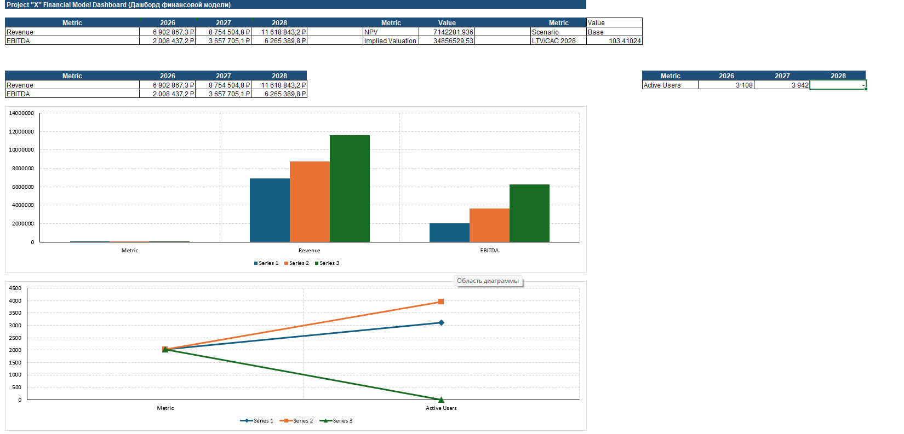
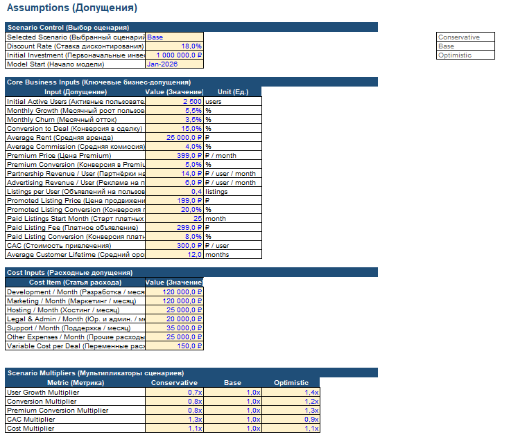
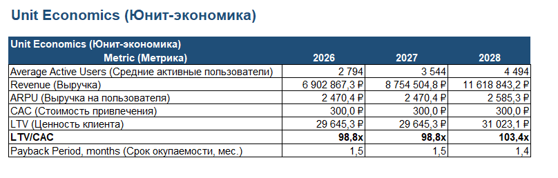
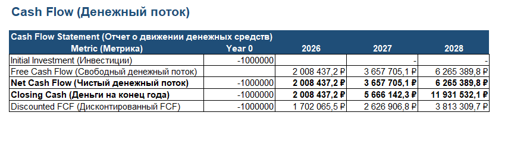
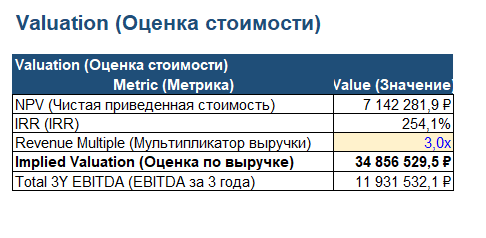
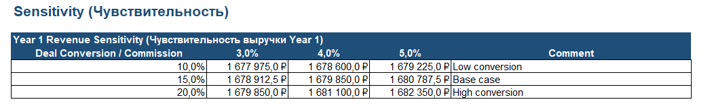

# Project X Financial Model

Portfolio financial model for an early-stage digital platform focused on student housing and roommate matching.

The model evaluates monetization strategy, user growth, unit economics, operating expenses, cash flow, valuation and sensitivity under different business scenarios.

## Executive Summary

- Model type: startup operating and valuation model
- Forecast period: 36 months
- Business concept: student housing and roommate matching platform
- Scenario cases: Conservative, Base, Optimistic
- Base scenario starting active users: 2,500
- Base scenario monthly user growth: 5.5%
- Base scenario monthly churn: 3.5%
- Base scenario deal conversion: 15.0%
- Base scenario average commission: 4.0%
- Base scenario discount rate: 18.0%

Selected base-case outputs visible in the workbook screenshots:

| Metric | Output |
|---|---:|
| 2026 Revenue | 6.90M RUB |
| 2027 Revenue | 8.75M RUB |
| 2028 Revenue | 11.62M RUB |
| NPV | 7.14M RUB |
| IRR | 254.1% |
| Implied valuation | 34.86M RUB |
| Total 3-year EBITDA | 11.93M RUB |

All assumptions are synthetic and used for portfolio, education and planning practice only.

## Business Concept

Project X is a digital platform that helps students and young professionals find compatible roommates and housing options through a more structured process.

The model evaluates whether the platform can become financially attractive through several monetization streams:

- transaction commission from successful rental deals
- premium subscription
- partnership revenue
- advertising revenue
- promoted listings
- paid listings after stronger marketplace traction

## Model Structure

The workbook includes:

| Sheet | Purpose |
|---|---|
| `Cover` | model overview and navigation |
| `Assumptions` | scenario selector and key business assumptions |
| `Monthly Model` | 36-month operating forecast |
| `Annual Summary` | annual revenue, EBITDA and active user summary |
| `Unit Economics` | ARPU, CAC, LTV, LTV/CAC and payback logic |
| `P&L` | profit and loss statement |
| `Cash Flow` | free cash flow and discounted cash flow |
| `Valuation` | NPV, IRR and revenue multiple valuation |
| `Sensitivity` | revenue sensitivity to deal conversion and commission |
| `Dashboard` | visual summary of key outputs |
| `README Notes` | workbook notes for GitHub documentation |

## Supporting Documentation

- [docs/model_overview.md](docs/model_overview.md)
- [docs/assumptions_and_scenarios.md](docs/assumptions_and_scenarios.md)
- [docs/valuation_methodology.md](docs/valuation_methodology.md)
- [docs/model_audit_notes.md](docs/model_audit_notes.md)
- [docs/improvement_backlog.md](docs/improvement_backlog.md)

## Screenshots

### Dashboard Preview



### Assumptions



### Unit Economics



### Cash Flow



### Valuation



### Sensitivity Analysis



## Key Analytical Features

- 36-month forecast
- scenario selector
- monthly user growth and churn logic
- revenue by monetization stream
- fixed and variable cost assumptions
- P&L forecast
- free cash flow forecast
- NPV and IRR framework
- revenue multiple valuation
- unit economics
- sensitivity analysis
- dashboard summary

## Skills Demonstrated

- financial modeling
- startup finance
- revenue modeling
- unit economics
- scenario analysis
- sensitivity analysis
- P&L forecasting
- cash flow forecasting
- valuation logic
- Excel model structure
- investment case preparation
- business analysis

## Repository Structure

```text
Project-X-Financial-Model/
|-- README.md
|-- LICENSE
|-- financial_model/
|   `-- Project_X_Financial_Model.xlsx
|-- docs/
|   |-- assumptions_and_scenarios.md
|   |-- improvement_backlog.md
|   |-- model_audit_notes.md
|   |-- model_overview.md
|   `-- valuation_methodology.md
`-- screenshots/
    |-- annual_summary.png
    |-- assumptions.png
    |-- cash_flow.png
    |-- cover.png
    |-- dashboard_preview.png
    |-- monthly_model.png
    |-- pnl_statement.png
    |-- sensitivity_analysis.png
    |-- unit_economics.png
    `-- valuation.png
```

## How To Review

1. Start with `README.md` for the business case and outputs.
2. Open `docs/assumptions_and_scenarios.md` to understand key drivers.
3. Open the workbook and review `Assumptions`, `Monthly Model`, `Unit Economics`, `Cash Flow`, `Valuation` and `Dashboard`.
4. Use `docs/model_audit_notes.md` and `docs/improvement_backlog.md` to understand current limitations and future improvements.

## Disclaimer

This is a synthetic portfolio model. It is not investment advice and should not be used for a real investment decision without validated market data, source-backed assumptions, full model audit and sensitivity review.
